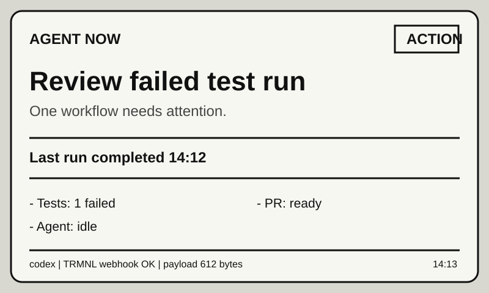

# trmnl-agent-bridge

Publish compact local agent status snapshots to TRMNL Private Plugin webhooks.

`trmnl-agent-bridge` is a local-first CLI and plugin bundle for sending calm status updates from Codex, Claude Code, scripts, CI, cron jobs, and other local automation to a TRMNL e-ink display. It does not run a hosted service and it does not need access to private prompts, logs, notes, mail, or calendar content.



## What It Does

- Validates a small `agent-status.v1` JSON payload.
- Wraps that payload under TRMNL webhook `merge_variables`.
- Pushes to a TRMNL Private Plugin webhook when explicitly requested.
- Stores webhook/device credentials through environment variables or macOS Keychain.
- Renders a local 800x480 HTML preview.
- Runs dry and live smoke tests.
- Ships Codex and Claude Code skills for setup, status publishing, and smoke tests.
- Includes TRMNL recipe packaging files for full, half, and quadrant layout variants.

## Why Use It?

An agent can create a one-off TRMNL webhook script. This project packages the reusable hard parts around that script: payload validation, dry-run output, credential redaction, macOS Keychain storage, payload size checks, smoke tests, local preview, TRMNL recipe layouts, setup docs, and Codex/Claude Code skills with explicit privacy rules.

Use it when you want a repeatable local bridge for "what needs attention now" status from agents, scripts, CI, cron jobs, or local automation. See `docs/value.md` for the longer rationale.

## Install

From a local checkout:

```bash
python3 -m venv .venv
. .venv/bin/activate
python3 -m pip install -e .
```

From GitHub after the repository is public:

```bash
pipx install git+https://github.com/jrausercisco/trmnl-agent-bridge.git
```

Check the CLI:

```bash
trmnl-agent status
trmnl-agent sample | trmnl-agent push --stdin --dry-run
```

The deprecated `trmnl-codex` alias is kept for early local experiments. New docs and examples use `trmnl-agent`.

## Quick Start

Validate the synthetic sample without sending anything:

```bash
trmnl-agent sample | trmnl-agent push --stdin --dry-run
```

From a local checkout, you can also validate the checked-in example payload:

```bash
trmnl-agent push --merge-file examples/sample-payload.json --dry-run
```

Render a local preview:

```bash
trmnl-agent preview --merge-file examples/sample-payload.json
trmnl-agent preview --layout quadrant --merge-file examples/sample-payload.json
```

Run the dry smoke test:

```bash
trmnl-agent smoke-test
```

## TRMNL Setup

1. Create a TRMNL Private Plugin.
2. Choose the webhook data strategy.
3. Paste the raw contents of `templates/agent-status.liquid.html` into the TRMNL markup editor.
4. Save the plugin so TRMNL generates a webhook URL.
5. Store the webhook URL outside the repo:

```bash
trmnl-agent keychain-set --account TRMNL_WEBHOOK_URL
```

If you are copying from a terminal on macOS, this puts the raw markup on your clipboard:

```bash
pbcopy < templates/agent-status.liquid.html
```

Do not copy from a browser-rendered view of the HTML file; that strips the markup tags and leaves only inline Liquid text.

6. Push only synthetic data first:

```bash
trmnl-agent sample | trmnl-agent push --stdin
```

See `docs/private-plugin-setup.md` for the full checklist.

The canonical single-template setup uses `templates/agent-status.liquid.html`. The `trmnl_plugin/` directory contains the same full layout plus recipe packaging files for TRMNL Recipe Gallery style submission or manual setup across full, half vertical, half horizontal, and quadrant display sizes.

## Agent Plugins

This repo contains two agent plugin bundles:

- Codex: `plugins/trmnl-agent-bridge`, cataloged by `.agents/plugins/marketplace.json`.
- Claude Code: `plugins/claude/trmnl-agent-bridge`, cataloged by `.claude-plugin/marketplace.json`.

Each bundle contains three skills:

- `publish-status`: create and dry-run or publish a privacy-safe status payload.
- `setup`: guide CLI and TRMNL Private Plugin setup.
- `smoke-test`: validate the bridge without exposing secrets.

Codex local marketplace development:

```bash
codex plugin marketplace add /path/to/trmnl-agent-bridge
```

Claude Code local marketplace development:

```bash
claude plugin marketplace add /path/to/trmnl-agent-bridge
claude plugin install trmnl-agent-bridge@trmnl-agent-bridge --scope local
```

See `docs/codex-plugin.md` and `docs/claude-plugin.md`.

## Payload Contract

The public payload is intentionally small:

```json
{
  "schema_version": 1,
  "source": "codex",
  "title": "AGENT NOW",
  "state": "ACTION",
  "headline": "Review failed test run",
  "detail": "One workflow needs attention.",
  "next": "Last run completed 14:12",
  "signals": [
    "Tests: 1 failed",
    "PR: ready",
    "Agent: idle"
  ],
  "health": "TRMNL webhook OK | payload 612 bytes",
  "updated": "14:13"
}
```

Allowed states are `CLEAR`, `WATCH`, `ACTION`, `BLOCKED`, and `FAIL`.

See `docs/payload-contract.md` and `schemas/agent-status.v1.schema.json`.

## Validation

Run the release validation script:

```bash
./scripts/validate-release.sh
```

It validates JSON files, runs unit tests, dry-runs the CLI, and runs Claude plugin validation when `claude` is installed.

## FAQ

### Is this a Claude usage dashboard?

No. Claude usage dashboards usually scrape Claude Code usage or parse local Claude session files to show cost, token, or rate-limit telemetry. This bridge publishes a small current-status signal from any local producer, such as Codex, Claude Code, scripts, CI, cron jobs, or personal automation.

### Does it read prompts or local session files?

No. The core bridge validates and sends only the payload you provide. The included examples are synthetic, and the agent skills instruct Codex and Claude Code to avoid prompts, logs, file bodies, customer data, mail, calendar content, and secrets.

### Why include recipe layout files?

The `trmnl_plugin/` directory makes manual Private Plugin setup and potential TRMNL Recipe Gallery submission easier. The CLI still works with a plain Private Plugin webhook and the single template in `templates/agent-status.liquid.html`.

### Why not just ask an agent to build a custom one?

For a single private experiment, that may be enough. The bridge exists so users do not have to rebuild and re-audit the same setup, secret-handling, validation, preview, recipe-layout, and smoke-test mechanics for every local agent workflow.

## Security

Treat TRMNL webhook URLs, device IDs, and API tokens as secrets.

Do not commit:

- `.env` files
- webhook URLs
- device IDs
- API tokens
- response JSON from live pushes
- rendered screen images containing private data
- payloads copied from private workflows

The bridge should publish compact status, not raw prompts, transcripts, logs, email/calendar content, customer data, local file bodies, or private notes. See `docs/security.md`.

## Project Layout

```text
trmnl-agent-bridge/
  src/trmnl_agent_bridge/
  schemas/agent-status.v1.schema.json
  templates/agent-status.liquid.html
  trmnl_plugin/
  examples/
  plugins/trmnl-agent-bridge/
  plugins/claude/trmnl-agent-bridge/
  .agents/plugins/marketplace.json
  .claude-plugin/marketplace.json
  docs/
  scripts/secret-scan.sh
  scripts/validate-release.sh
  .github/workflows/ci.yml
  tests/
```

## Roadmap

- Add GitHub Action and cron examples.
- Add packaged binary releases.
- Add Homebrew and PyPI distribution paths.
- Add Windows Credential Manager and Linux Secret Service support.
- Consider optional Codex and Claude hook examples that remain disabled by default.

## Non-Goals

- This is not an official TRMNL, OpenAI, Codex, Anthropic, or Claude Code project.
- This is not a hosted service.
- This does not publish private knowledge-base, calendar, mail, or customer data.
- This does not add automatic Claude or Codex hooks in the MVP.

## License

MIT. See `LICENSE`.
